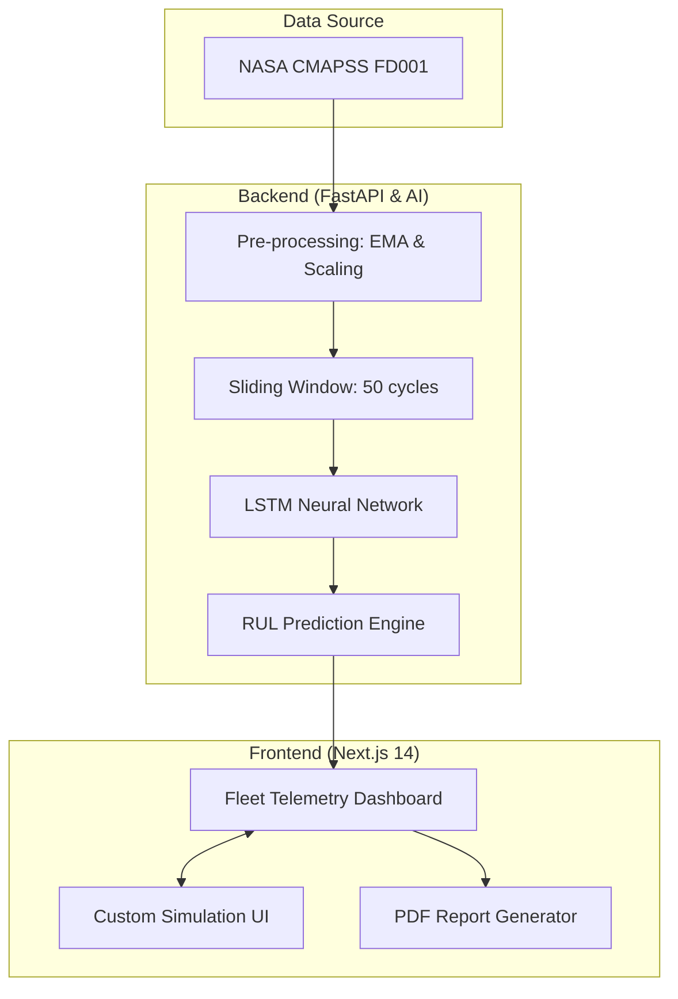

<div align="center">
  

  # ✈️ NASA Jet Engine — Predictive Maintenance AI
  **A Deep Learning Platform for Turbofan Engine Remaining Useful Life (RUL) Prediction**

  [](#)
  [](#)
  [](#)
  [](https://opensource.org/licenses/MIT)
  
  ### 🌍 [Live Demo (Vercel)](https://nasa-turbofan-engine-predictive-mai.vercel.app/)

  *🇬🇧 English Documentation | 🇹🇷 Türkçe Dokümantasyon*
</div>

---

## 🔧 Project Architecture



---

## 🇹🇷 Türkçe (Turkish)

### 🚀 Proje Sunumu
Bu proje, havacılık sektöründe kritik öneme sahip olan **Kestirimci Bakım (Predictive Maintenance)** süreçlerini modernize etmek için geliştirilmiştir. NASA'nın CMAPSS veri setini temel alan bu sistem, jet motorlarının sensör verilerini analiz ederek arızadan önceki kalan ömürlerini (RUL) saniyeler içinde hesaplar.

#### ✨ Öne Çıkan Özellikler
- **Gerçek Zamanlı Telemetri:** 100 farklı motorun sensör geçmişini ve yapay zeka analizini görselleştirir.
- **LSTM Tahminleme:** Zaman serisi verilerdeki bozulma paternlerini yakalayan çift yönlü LSTM yapısı.
- **Esnek Simülasyon:** Teorik verilerle motor sağlığı testi yapabilme imkanı.
- **Kurumsal Raporlama:** Analiz sonuçlarını PDF formatında dışa aktarma.

---

## 🇬🇧 English

### 🚀 Project Presentation
This platform is designed to modernize **Predictive Maintenance** in the aerospace industry. By leveraging NASA's CMAPSS dataset, the system analyzes jet engine sensor telemetry to estimate the Remaining Useful Life (RUL) with high precision before any failure occurs.

#### ✨ Key Features
- **Real-time Telemetry:** Visualize sensor history and AI analytics for 100 different engines.
- **LSTM Forecasting:** Bidirectional LSTM architecture specifically designed to capture degradation patterns in time-series data.
- **Flexible Simulation:** Test engine health using custom theoretical sensor inputs.
- **Enterprise Reporting:** Export detailed analysis results as PDF documents.

---

## 🧠 Technical Deep Dive

### AI Pipeline & Processing
1.  **Data Cleaning**: Dropping zero-variance sensors and constant operational settings.
2.  **Smoothing**: Applying **Exponential Moving Average (EMA)** with span=5 to reduce sensor noise.
3.  **Windowing**: Generating sliding windows of **50 flight cycles** for time-series modeling.
4.  **Model**: A custom Sequential Keras model featuring **LSTM layers**, **Batch Normalization**, and **Dropout** for robust generalization.

### Tech Stack
| Tier | Technologies |
|------|--------------|
| **AI/ML** | TensorFlow 2.16.1, Keras, Scikit-learn, Pandas |
| **API** | FastAPI, Uvicorn, Python 3.10 |
| **Web** | Next.js 14 (App Router), TailwindCSS, Recharts, Lucide |
| **Cloud** | Vercel (Frontend Deployment) |

---

## ⚙️ Local Installation

```bash
# Clone the repository
git clone https://github.com/gkdz417/NASA-Turbofan-Engine-Predictive-Maintenance.git

# Setup Backend Dependencies
cd backend && pip install -r requirements.txt

# Start Backend
uvicorn api:app --reload

# Setup Frontend (different terminal)
cd frontend && npm install && npm run dev
```

---

<div align="center">
  <b>Developed by <a href="https://github.com/gkdz417">Gökdeniz Erten</a></b>
  <br>
  <i>MIT License | Academic Project for Deep Learning Applications</i>
</div>
